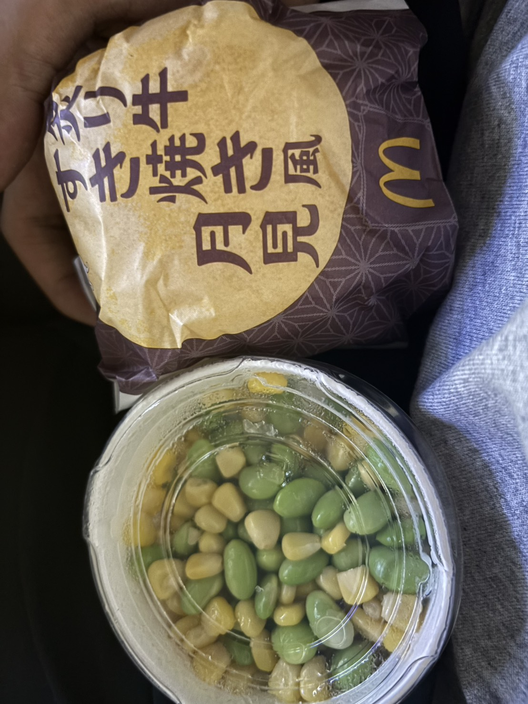

成績が公開された。なんだこれは、高すぎる。この2年くらいの間、成績がよすぎる。 

怖い。なにかを見落としていないだろうか。間違ってますよ！大人の人！ 
ぼくのせいで損する人間がいないだろうか。居もしない誰かに申し訳なくなる。 

なにかの陰謀により操作され、自分だけが踊らされて見世物になっていないか？みんな本当は笑っているんじゃないのか？成績通知書の細かい文字に「見世物」の3文字を探したが見当たらなかった。 

中学では成績がよかった。中学で成績がよかった人として例にもれず、高校の定期テストは赤点まみれだった。数字だけみれば見事なカムバックを果たしている。それでも、いつまで経っても中学と同じようには思えない。 

成績をとることに関して、要領がよくなった実感はある。 
シラバスを確認し、何によって自分が評価されるのか、先生の顔を見つめながらその思惑を想像する。バイトのタイムカードを切るかのように評価点を押さえる日々。紛れもない成長だが喪失感もある。 

---
褒め言葉を素直に受け取ることが苦手た。 

ぼくは勤勉とは程遠い人間である。だから褒められても実感を得ず、いつか正体を見破られるのではないかと、毎日が闇雲に怖い。 

叶えたい夢があって、堅実に努力している人がいる。今は成績で評価されていても、計画性と継続力、めげない愛嬌をもったその人なら、いつかきっと報われるのだと思う。でもその人にとって、その日を待つのは、暗闇の中で迷子になりながら手足の感覚を確かめるような日々だろう。 

そんな人を思うと申し訳なくなる。 
ぼくが「いい子、いい子」とヨシヨシ頭を撫でられても、それは飼い主とって都合がいいことにしか過ぎない。 
本当はいろんな子がいて、電柱におしっこしても、隣人にバウバウ吠えても、部屋中荒らしてもかわいい子じゃないか。なんでぼくだけ褒めるんだ。どんな顔をして尻尾を振ればいいのか分からない。 

困ったことに、それは相手を見下した大変に失礼な邪推になる（ましてや犬のように見ている）。 
せっかく褒めてもらったのに、「いえいえ、そんなことないです」と拒否するのは、相手の好意をないことにしてしまう。ぼくだって、はいどうぞと誰かと成績を交換するつもりはないのだから、そんなことは口が裂けても言ってはいけない。 

---

晩御飯に月見バーガーを買った。うまい。 
成績の代わりに、ひとまず月見バーガーを受け取ることから始めた。いつまで経ってもいい成績をとることに慣れないが、いつか誰かに褒められたら、そのときはきちんと受け止めなければいけない。

