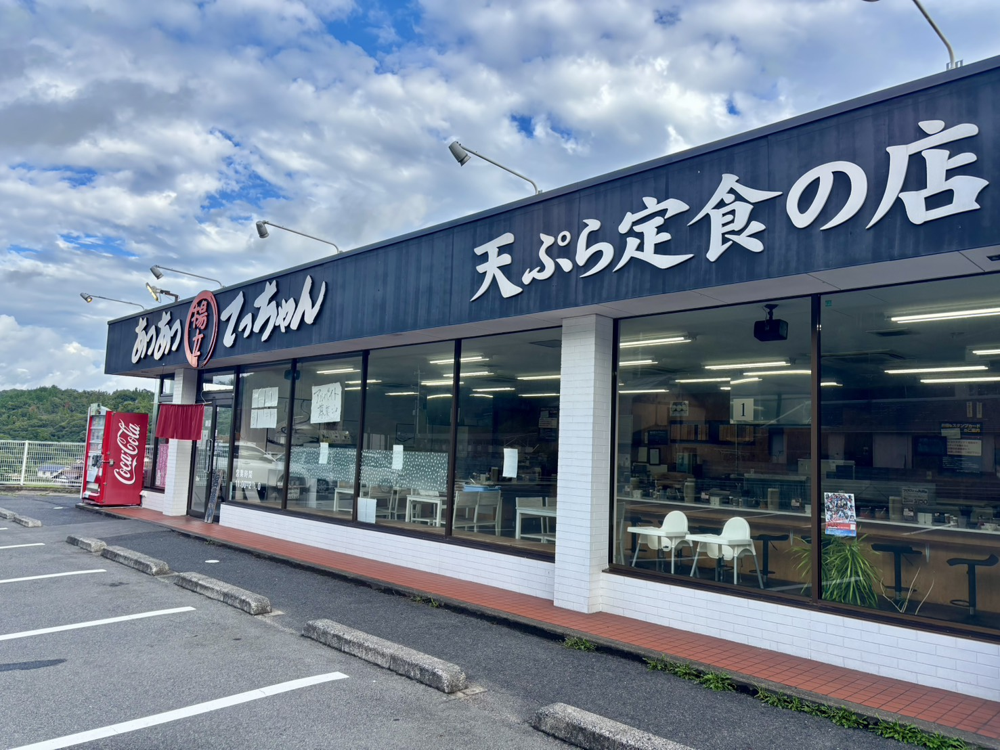
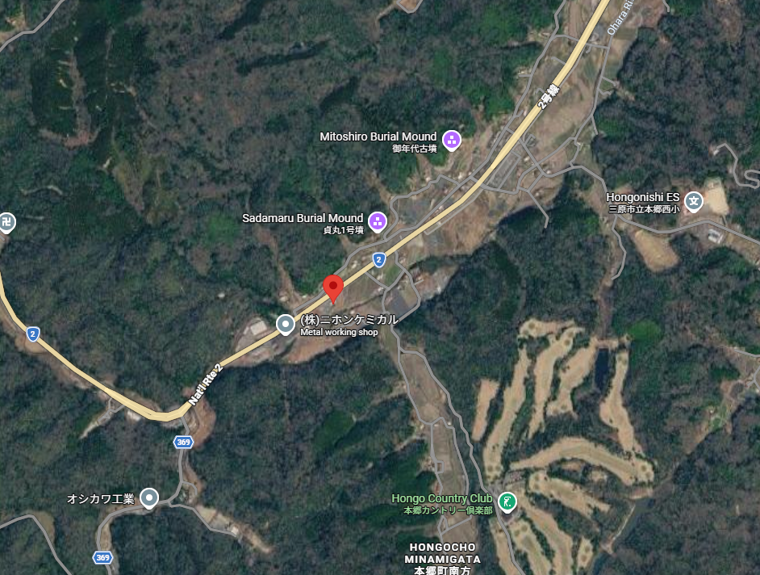
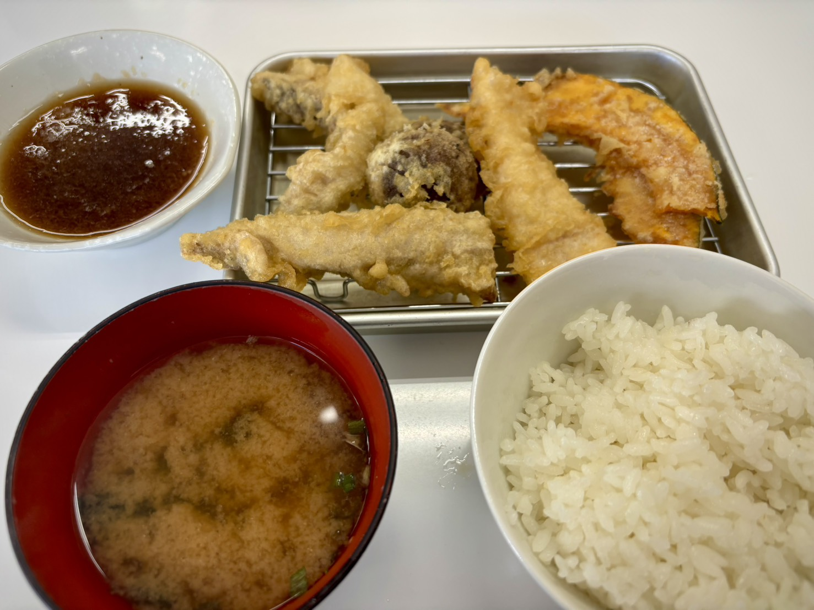

広島には、「[あつあつ揚立てっちゃん](http://www.atsuatsu.jp/index.html)」という天ぷら定食のチェーン店がある。今日はその本郷店へ行ってきた。 

本郷店は、広島県東部の国道2号線沿いにその店を構えている。 

山と畑を切り開くように進む道中、大きく筆文字で「**天ぷら定食**」と書かれた看板が下り車線側に見えてくる。この道を一度通れば、その看板を見落とすことはまず無いはずだ。 

---

食にこだわりがないぼくだけど、「あつあつ揚立てっちゃん」と、「電光石火（お好み焼きのお店）」は目がないほど大好きだ。 

そんなぼくにとって、まず**例の看板はデカすぎる**。 

（肝心の看板の写真を撮り忘れましたが、代わりに本郷店の航空写真を添えます。） 

写真とともに、想像してくだされば幸いである。 
広々とした田舎道をゆるやかに走っていると、仮に、ランクルを積んだ積車が前を走っていようが、そのランクルの遥か頭上から四角い人工物が強制的に視界に入る。例の巨大看板である。 
緑と青の自然豊かな色彩の中に、急に筆文字の無機質なモノトーンが鎮座し、割り込んでくる。 

時間の感覚を忘れ、桃源郷を往くかのような心地でゆったりと車を走らせていたはずが、否応なしに蓮根と抹茶塩を、長らく忘れていたカボチャの甘みの真味を、あっさりとしつつも、ゼラチン質が舌の上で官能的に泳ぎだす太刀魚を、引き戻されるかのように思い出してしまう。 

何故あんなにも看板をデカくする必要があった？ 
2号線を通るたびに、天ぷらが食べたい気持ちとヨダレを我慢するのに苦労する。巨大看板に日常を脅かされ続けている。

---

そんな苦労もついに実を結び、本日やっと本郷店へ来ることができた。半年ぶりである。 
こんなに語っておきながらも頻繁に行かないのは、家との距離の問題とか、学生だからお金がないというのもある。天ぷらには申し訳ないことをしていると思う。 

入店すると、2号線沿いだからか、大体作業服を着た常連らしきおじさんや老夫婦がちらほら居て、黙々と食事している。学生っぽいお客さんは比較的少ない気がする。 

二郎系とか牛丼屋のように、まずは券売機でメニューを選ぶ。 

- 天ぷら定食―900円
- 上天ぷら定食―1,200円
- 特上定食―1,600円
- あなご天定食―1,400円
- 海老天定食―1,300円
- とり天定食―1,000円
- 炙り太刀天重―1,300円
- その他にも色々... 
[（参考）あつあつ揚立てっちゃん　メニュー](http://www.atsuatsu.jp/menu.html) 

天ぷら屋さんの相場が分からないけれど、評判からしてかなり安いのだろう。 
ただ、数少ない学生として正直に言うと、頻繁に来ようとは思えない金額である。実際「天ぷら定食」と「とり天定食」しか食べたことがない。でも将来は「上」とか「特上」とかも食べれると思うと、就活のやる気が俄然わいてくるというものだ。

---
今日は**天ぷら定食**を注文した。 

清潔で派手な装飾がない店内で、カウンターに座らされると、ご飯とお味噌汁、天つゆと天ぷらを置くためのバットが配膳される。 
天つゆはオリジナルなのだろうか。甘い大根おろしがたっぷりと浸されており、自由にとれる漬物も種類が豊富に思える（漬物は店舗によって種類が異なる気がする）。 

あつあつ揚立てっちゃんでは、その名の通り熱々で揚立の天ぷらが一品ずつ手元のバットに提供される。 
定かではないけれど、同じ天ぷら定食でもメニューが季節か店舗によって少し変動する気がしている。そんなところも、たまにくる客としての楽しみである。  

今日はまず、**ちくわの天ぷら**から頂いた。 
一口目は何も付けずに、そのまま口へ運ぶ。 

一瞬熱いと空気を吸い込むが、火傷するほどではなく、ほこほことした素朴な温度をしていることに気づく。軽い衣が噛んだ瞬間だけ、しゃくっと存在する。油の持つ透明なコクが、軽く滑るように消えてゆき、白身魚の甘味と絡み合ってかすかに鼻を抜ける。衣と油により、謙虚な味わいの中に複層的な広がりを見出せる気がしてくる。 

続いて**カボチャ**と**椎茸**が届く。何よりカボチャである。 
カボチャのことを、小さい頃から微妙に思っていた。上手く甘味を引き出しても、歯に絡みつき、水気のなさと重い歯ごたえが、ぬめりや妙ななめらかさを演出するところが好きになれなかった。理想の姿は見えるのに、あと1歩、体が収まりきらないもどかしい存在だった。プリンになりたい粘土である。 

そんなカボチャが、不思議に収まりがいい。 
薄い衣が表面に心地いい歯ごたえをつくり、その内側では熱を含んだ実がほろりと崩れる。スイートポテトかと思うくらい甘い。口の中に張り付く前に衣と油がほどいてくれるので、甘味だけを素直に受け取ることができる。カボチャは最初からプリンなど目指していない。カボチャは天ぷらになりたかったのである。

こんな序盤に（3枚も）提供されるカボチャだが、いつも1枚は最後まで残しておく。好きなものは最後に食べるタイプだ。 

---
揚がった天ぷらを少しずつ食べ、ご飯を一口だけ食べる。 

まだ序盤である。 
ここでごはんを食べすぎてはいけない。まだ太刀魚もサバも鶏も控えているはずだが、もっとも、どの順番で来るのかはわからない。理想は最後の一品と一口が同時に終わることを目指している。 

ちくわ、カボチャ、椎茸までは首尾よく運んでいた。塩で食べるならご飯は控えめにし、天つゆを使ったなら少し多めにする。天ぷら一品に対して、どのくらいご飯を使うか。 

そもそも、天ぷらを何で食うのかという議論には、一悶着あるはずだ。 
塩で食うと衣のサクサク感がそのまま残り，素材そのものが持つ旨味をシンプルに引き立てる。実際，ここまでほとんどの品に塩を付けている。 

しかし，料理番組の審査員が決まって「あえて塩でね」なんて言うことには，真っ向から反対させていただく。サクサクの天ぷらを，自らジュンジュンに浸すことには背徳感すら覚える。小さな気泡が浮かんで，衣が解けるように出汁が染み込んでいく。

湯加減いかがですか？

大根おろしを絡めて 

やたら長いので一度切ります。 
[続き](https://hellokonitiwa.github.io/hatibeta-blog/posts/2026-09-15-2/)

